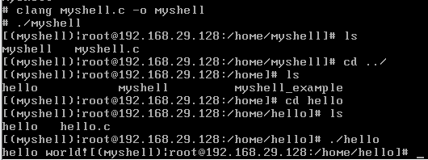
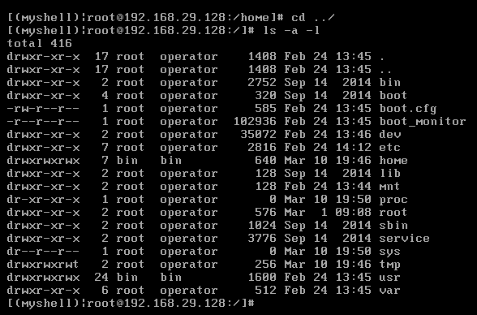
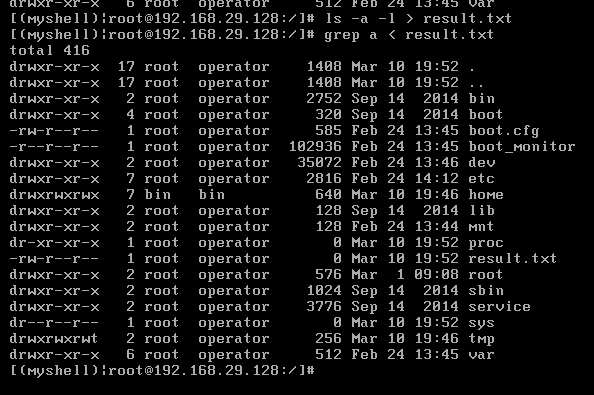
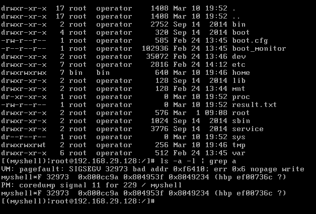
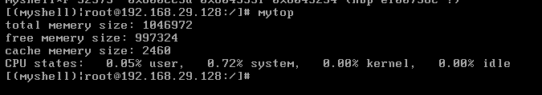
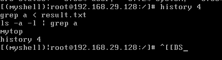
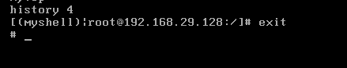

#  <center>《操作系统》实验报告一</center>

## <center>Shell及系统调用</center>
##### <center>指导教师：翁楚良
##### <center>姓名：杨舜&nbsp;&nbsp;&nbsp;&nbsp;&nbsp;  学号：10205501415


### 一、&nbsp;&nbsp;实验内容
- 1. 安装MINIX操作系统(Version:3.3)
- 2. 学习Shell，系统编程，实现一个基本的Shell

### 二、实验要求
- 1.Shell能解析的命令行如下：
  - 1. 带参数的程序运行功能；
  - 2. 重定向功能，将文件作为程序的输入/输出；
  - 3. 管道符号“|”，在程序间传递数据；
  - 4. 后台符号& ,表示此命令将以后台运行的方式执行；
  - 5. 工作路径移动命令cd；
  - 6. 程序运行统计mytop；
  - 7. shell退出命令exit；
  - 8. history n显示最近执行的n条指令。 

### 三、实验过程
- 1.Minix操作系统的安装以及虚拟机的配置
  - 1.安装VMware Workstation Pro
  - 2.下载并安装Minix3系统镜像文件
  - 3.服务器开机并安装开发环境
  ```
  pkgin update
  pkgin install git-base
  pkgin install openssh
  pkgin install vim
  pkgin install clang
  pkgin install binutils
  ```
- 2.myshel实现的基本框架
  - 1.在终端实现shell的基本提示符，并一直检测用户的键入和执行，因此利用while循环来持续打印提示符并等待用户键入
  ```c
  while(1){
    printf("[myshell]#")
  }
  ```
  - 2.对于用户的键入，利用fgets函数来实现对用户的所有键入的读取
  ```c
  (fgets(cmdline, MAXLINE, stdin) == NULL) //读取键入的数据流到全局变量cmdline
  ``` 
  - 3.对于普通的shell一般会实现在提示符中打印用户的姓名以及主机的ip和当前的工作环境，依次实现getUsername(),getHostname(),getCurWorkDir()函数并添加到终端中的循环打印
  ```c
  void getUsername() { // 获取当前登录的用户名
	struct passwd* pwd = getpwuid(getuid());
	strcpy(username, pwd->pw_name);
  }

  void getHostname() { // 获取主机名
	gethostname(hostname, MAXLINE);
  }

  int getCurWorkDir() { // 获取当前的工作目录
	char* result = getcwd(curPath, MAXLINE);
	if (result == NULL)
		return 0;
	else return 1;
  }

  printf("[(%s)|%s@%s:%s]# ", prompt, username, hostname,curPath);//提示符打印
  ```
  -  4.对于用户的键入，首先实现命令的分段解析函数parseline()函数，将cmdline中的字符串依据空格划分并存入到argv中
  ```c
  int parseline(const char *cmdline, char **argv) {
    static char array[MAXLINE]; /* holds local copy of command line */
    char *buf = array;          /* ptr that traverses command line */
    char *delim;                /* points to first space delimiter */
    int argc;                   /* number of args */

    strcpy(buf, cmdline);
    // printf("buf:%s",buf);
    buf[strlen(buf)-1] = ' ';  /* replace trailing '\n' with space */
    while (*buf && (*buf == ' ')) /* ignore leading spaces */
	  buf++;

    /* Build the argv list */
    argc = 0;
	  delim = strchr(buf, ' ');

    while (delim) {
	  argv[argc++] = buf;
	  *delim = '\0';
	  buf = delim + 1;
	  while (*buf && (*buf == ' ')) /* ignore spaces */
	         buf++;
	  delim = strchr(buf, ' ');
    }
    argv[argc] = NULL;
    
	  return argc; /* Get the count of argv */
  }
  ```
  -  5.实现shell中一些内置命令例如quit,cd,exit,用buildin_cmd同一调用这些函数
  ```c
  int buildin_cmd(char **argv) {
    if((!strcmp(argv[0],"quit"))||(!strcmp(argv[0],"exit"))){
        _exit(1);
    }
    if(!strcmp(argv[0],"cd")){
        __cd__(argv);
        return 1;
    }
    return 0;
  }
  void __cd__(char **argv) {
    int ret = chdir(argv[1]);
    if (ret)
    {
        fprintf(stderr,"Error: Can't find the path\n");
    }
    return;   
  }
  ```
  -  6.命令执行函数，实现eval函数解析并调用execv-族函数实现带参数的函数运用功能<br>
  其中利用fork函数划分子进程与父亲进程，子进程调用excev-族函数执行命令，父进程等待子进程的返回并判断命令的执行情况，是否子进程为错误结束或命令正常执行结束。
  ```C
  void eval(char *cmdline) {
    char *argv[MAXARGS];
    int argc = parseline(cmdline,argv);
    // printf("checkpoint1\n");
    if (buildin_cmd(argv)!=0) /* 执行quit,cd等内置函数 */
    {
        return;
    }
    // for (int i = 0; i < argc; i++)
    // {
    //     printf("%s\n",argv[i]);
    // }
    
    
    pid_t pid;

    if ((pid = Fork()) == 0) { /* 子进程 */
        if (execvp(argv[0], argv) < 0){
            // fprintf(stderr, "%s: Command not found\n", argv[0]);
            _exit(errno); // 执行出错，返回errno
            // _exit(1);
        }
    }
    else {
        int status;/* 判断子进程结束的状态，1表示错误结束，0表示正常结束 */
        waitpid(pid, &status, 0);
        // printf("%d\n",status);
        if(status) {
            fprintf(stderr, "%s: Command not found\n", argv[0]);
        }
        fflush(stdout);
    }

  }
  ```
  至此myshell的一些基本框架已经实现，可以实现通过内置命令cd、quit、exit等同时可以实现带参数的程序运行。
- 3.myshell功能的完善一(错误类型封装)
  - 通过对基本常见的错误类型用枚举变量进行映射，用于监控不同指令的返回状态。
  ```c  
  enum{
    /* normal return */
    NORMAL_RETURN,

    /* not built-in command */
    NOT_BUILTIN,

    /* fork error */
    ERROR_FORK,
    
    /* command not found */
    ERROR_COMMAND,

    /* lost parameter */
    ERROR_LOST_PARAMETER,

    /* too many parameters */
    ERROR_TOO_MANY_PARAMETER,

    /* system error*/
    ERROR_SYSTEM,

    /* path not found */
    ERRRE_PATH_NOT_FOUND,

    /* file not exist */
    ERROR_FILE_NOT_EXIST

    /* 重定向错误 */

    /* 管道错误 */
  };
  ```
- 4.myshell功能的完善二(重定向功能的实现)  
  - 要实现重定向功能，首先实现对重定向命令的解析。解析并获取带有重定向部分的命令
  ```c  
  for (int i = 0; i < argc; i++) {
        if (!strcmp(argv[i],"<")) {
            inNum++;
            if (i+1 < argc) {
                infile = argv[i+1];
            } else { 
                return ERROR_REDIRECTION_NO_IN;
            }
            if ((endIndex) == argc) {
                endIndex = i;
            }
        } else if (!strcmp(argv[i],">")) {
            outNum++;
            if (i+1 < argc) {
                outfile = argv[i+1];
            } else { 
                return ERROR_REDIRECTION_NO_OUT;
            }		
            if ((endIndex) == argc) {
                endIndex = i;
            }
        } else if (!strcmp(argv[i],">>")) {
            appendNum++;
            if (i+1 < argc) {
                appendfile = argv[i+1];
            } else {
                return ERROR_REDIRECTION_NO_APPEND;
            }
            if ((endIndex) == argc) {
                endIndex = i;
            }
        }
    }
  ```
  - 对含有重定向命令部分进行错误情况分析与判断
  ```c
  if (inNum == 1) { /* 判断输入文件是否存在 */
		FILE* fp = fopen(infile, "r");
		if (fp == NULL) {
            return ERROR_FILE_NOT_EXIST;
        }
		fclose(fp);
	}
	if (inNum > 1) { /* 输入重定向符超过一个 */
		return ERROR_MANY_IN;
	} else if (outNum > 1) { /* 输出重定向符超过一个 */
		return ERROR_MANY_OUT;
	} else if (appendNum > 1) { /* 追加重定向符超过一个 */
        return ERROR_MANY_APPEND;
    }
  ```  
  - fork新建进程执行命令，并将输出输出到重定向输出文件，或者读取重定向输入文件，作为命令运行的参数输入
  ```c
  if ((pid = Fork()) == 0) { /* 子进程 */
        if (inNum == 1) {
            freopen(infile, "r", stdin);
        }
        if (outNum == 1) {
            freopen(outfile, "w", stdout);
        }
        if (appendNum == 1){
            freopen(appendfile, "a", stdout);
        }
        char *argv_tmp[MAXARGS];
        for (int i = 0; i < endIndex; i++) {
            argv_tmp[i] = argv[i];
        }
        argv_tmp[endIndex] = NULL;
        execvp(argv_tmp[0],argv_tmp);
        exit(errno);
    }
  else {
        int ret;
        waitpid(pid, &ret, 0);
        // printf("%d\n",status);
        if(ret) {
            fprintf(stderr, "%s: Command not found\n", argv[0]);
        }
        fflush(stdout);
  }
  ```
  - eval()函数中调用重定向执行，并对与返回的错误类型执行对应的错误输出
  ```c  
  int status;
  status = isRedirect(argv,argc);
  if (status == NORMAL_RETURN){
        return;
  } else if (status == ERROR_FILE_NOT_EXIST) {
    fprintf(stderr,"重定向文件不存在");
    return;
  } else if (status == ERROR_REDIRECTION_NO_IN) {
    fprintf(stderr,"没有重定向输入文件");
    return;
  } else if (status == ERROR_REDIRECTION_NO_IN) {
    fprintf(stderr,"没有重定向输出文件");
    return;
  } else if (status == ERROR_REDIRECTION_NO_IN) {
    fprintf(stderr,"没有重定向追加文件");
    return;
  } else if (status == ERROR_MANY_IN) {
    fprintf(stderr,"输入重定向符超过一个");
    return;
  } else if (status == ERROR_MANY_OUT) {
    fprintf(stderr,"输出重定向符超过一个");
    return;
  } else if (status == ERROR_MANY_APPEND) {
    fprintf(stderr,"追加重定向符超过一个");
    return;
  }
  ```
- 5.myshell功能完善三(管道功能)
  - 管道的具体逻辑是将管道前的命令执行得到的结果作为输入给管道后面的指令，而在前一步我已经完成了重定向和指令运行，所以管道实现过程中主要是要实现将调用前面的带有重定向执行的函数来执行命令
  - 首先实现解析管道命令“|”
  ```c  
  int pipeIndex = -1;
    for (int i=0; i<argc; ++i) {
		if (strcmp(commands[i], "|") == 0) {
			pipeIndex = i;
			break;
		}
	}
    if (pipeIndex == -1) {
        
    } else {

    }
  ```  
  - 对于没有管道命令的输入，正常调用后面的执行即可；对于有管道的命令的输入，进行其他的判断和执行
  - 对于输入正常的管道命令执行，首先子进程获取输出文件符，并完成管道命令之前的命令，父进程等待管道命令前面完成，然后获取输入文件符，将标准输入重定向，然后再执行管道命令后的命令
  ```c  
  pid_t pid = Fork();
	if (pid == 0) { // 子进程执行单个命令
		close(fds[0]);
		dup2(fds[1], STDOUT_FILENO); // 将标准输出重定向到fds[1]
		close(fds[1]);
		/* 执行“|”命令 */
		exit(result);
	} else { // 父进程递归执行后续命令
		int status;
		waitpid(pid, &status, 0);
		int exitCode = WEXITSTATUS(status);
		close(fds[1]);
		dup2(fds[0], STDIN_FILENO); // 将标准输入重定向到fds[0]
		close(fds[0]);
		/* 执行“|”后的命令 */
	}
  ```
  - 对于管道命令前后的命令进行解析分隔
  ```c    
  char **preCommand;    /* 管道命令前的命令 */
  char **lastCommand;   /* 管道命令后的命令 */
  int preCount = -1;
  int lastCount = -1;
  int i = 0;
  int j = 0;
  int k = 0;
  for (i = 0; i < pipeIndex; i++)
  {
    strcpy(preCommand[i],argv[i]);
  }
  preCommand[i] == NULL;
  preCount = i;
  for (j = pipeIndex+1, k = 0; j < argc; j++, k++)
  {
    strcpy(lastCommand[k],argv[j]);
  }
  lastCommand[k] == NULL; 
  lastCount = k;
  ```
  - 分别执行前后命令
  - 对调用管道前后分别保存输入输出的文件标识符并进行恢复
  ```c  
  int inFds = dup(STDIN_FILENO);
  int outFds = dup(STDOUT_FILENO);
  int result = pipeCommand(argv,argc);
  /* 还原标准输入、输出重定向 */
  dup2(inFds, STDIN_FILENO);
  dup2(outFds, STDOUT_FILENO);
  exit(result);
  ```  
  - 对错误封装添加如下两种错误的描述
  ```c
  else if (status == ERROR_PIPE) {
            fprintf(stderr,"管道生成失败");
            return;
        } else if (status == ERROR_PIPE_NO_PARAMETER){
            fprintf(stderr,"管道命令没有参数");
            return;
        }
  ```
- 6.myshell功能完善(后台运行功能)
  - 第一步解析命令中的后台操作符 &
  ```c
  if (*argv[argc-1] == "&")
    {
        workBack = 1;
        argv[--argc] = NULL;
    }
	return argc; /* Get the count of argv */
  ```
  - 区分前后台工作需要对信号进行处理，怎加信号处理函数
  ```c
  void sigchld_handler(int sig);
  void sigtstp_handler(int sig);
  void sigint_handler(int sig);
  void sigquit_handler(int sig);

  typedef void handler_t(int);
  handler_t *Signal(int signum, handler_t *handler);
  ```
  - 前台父进程的后续工作依据子进程结束后向父进程发送的信号，对停止信号进行处理
  ```c
  signal(SIGINT,mask_ctrl_c);
  static void mask_ctrl_c(int signo)
  {
	printf("\n");
    int workDir = getCurWorkDir();
	  workDir = getCurWorkDir();
    getHostname();
    getUsername();
    if (workDir == ERROR_SYSTEM)
    {
        fprintf(stderr,"Error: System error while getting current work directory.\n");
        _exit(ERROR_SYSTEM);
    }
    printf("[(%s)|%s@%s:%s]# ", prompt, username, hostname,curPath); 
	  fflush(stdout);
  }     
  ```
  - 因为是存在后台执行，所以再eval函数中需要对进程添加阻塞信号，并让子进程以一个新的进程组完成指令
  ```c
  sigset_t mask, prev;
    sigemptyset(&mask);
    sigaddset(&mask, SIGCHLD);
    sigprocmask(SIG_BLOCK, &mask, &prev); /* 同时为子进程和父进程阻塞信号 */

    pid = fork();
  ```
  - #### 这里之所以要再fork之前阻塞信号是为了防止子进程还没有生成新的进程组之前就被前台父进程发送的signal信号打断了，所以先要给子进程与父进程所在组同时阻塞信号
  - 父进程解除信号阻塞同时判断作业是否为前台执行或者后台执行，如果为前台执行需要等待子进程的结束 信号之后依据返回的错误类型进行前台输出后返回，若为后台执行则不等待子进程的结束直接返回
  ```c
  if(workBack){
            sigprocmask(SIG_SETMASK, &prev, NULL);
            return;
        }else{
            sigprocmask(SIG_SETMASK, &prev, NULL);
            waitpid(pid, &status, 0);
            /* 错误类型封装 */
        }
  ```
- 7.myshell功能完善(history n指令)
  - 首先将每次输入的cmdline都写入指定的文件home/history/history.txt文件中
  ```c
  #define FILE_NAME "/home/history/history.txt" /* 文件路径 */

  FILE* fp = NULL; // 文件指针
	char* szAppendStr = cmdline;
 
	/* 以附加方式打开可读/写的文件, 如果没有此文件则会进行创建，然后以附加方式打开可读/写的文件 */
	fp = fopen(FILE_NAME, "a+");
 
	/* 打开文件失败 */
	if (fp == NULL)
		exit(-1);
 
	/* 将追加内容写入文件指针当前的位置*/
	fputs(szAppendStr, fp);
 
	/* 关闭打开的文件*/
	fclose(fp);
  ```
  - 添加内置命令history
  ```c
  if(!strcmp(argv[0],"history")){
        status = NORMAL_RETURN;
        status = historyN(argv,argc);
        return status;
    }
  ```
  - 实现historyN函数
  ```c
  int historyN(char **argv,int argc){
    int status = NORMAL_RETURN;
    if (argc == 1){
        return ERROR_HISTORY_NO_PARAMETER;
    }
    else{
        int N = atoi(argv[1]);
    // printf("%d\n",N);
    // printf("check point 1\n"); 
        char s[1024];
        FILE *fp;
        int lines=0;
        fp=fopen(FILE_NAME, "r");
        // printf("check point 1\n");
        int readSta = 0;
        if(fp)
        {
            while((fgets(s,1024,fp)) != NULL)
                if(s[strlen(s)-1]=='\n') lines++;
            // printf("%d\n",lines);
            readSta = lines - N;
            lines = 0;
            // printf("check point 1\n");
            fclose(fp);
        }
        // printf("%d\n",readSta);
        fp=fopen(FILE_NAME, "r");
        if (fp)
        {
            while((fgets(s,1024,fp)) != NULL){
                // printf("check point 1\n");
                if(s[strlen(s)-1]=='\n') lines++;
                if (lines == readSta) break;
            }
            while ((fgets(s,1024,fp)) != NULL)
                printf("%s",s);
            fclose(fp);
        }
    }
    return status;
  }
  ```
  - 前端输入cmdline存入history文件
  ```c
  FILE* fp = NULL; // 文件指针
	    // char* szAppendStr = cmdline;
        // printf("%s\n",cmdline);
        // printf("%p\n",fp);
        // printf("%s\n",szAppendStr);
	    /* 以附加方式打开可读/写的文件, 如果没有此文件则会进行创建，然后以附加方式打开可读/写的文件 */
	    fp = fopen(FILE_NAME, "a+");
        // printf("%p\n",fp);
	    /* 打开文件失败 */
	    if (fp == NULL)
		    exit(-1);
	    /* 将追加内容写入文件指针当前的位置*/
	    fputs(cmdline, fp);
	    /* 关闭打开的文件*/
	    fclose(fp);
  ```
  - ##### 具体是实现思路是将每次的cmdline存入文件，读取文件中命令的行数，在依据参数n计算输出的位置，将后续指令到文件尾部进行全部的输出
- 8.myshell功能完善(mytop指令)
  - 首先在build_cmdin中添加内置命令mytop的解析
  ```c
  if(!strcmp(argv[0],"mytop")){
        status = NORMAL_RETURN;
        status = mytop();
        return status;
    }
  ```
  - 实现mytop函数
  ```c
    int status = NORMAL_RETURN;
    // FILE *memp = NULL;
    // char mems[1024];
    // memp = fopen(MEMINFO,"r");
    // if (memp == NULL){
    //     exit(-1);
    // }
    // fgets(mems,1024,memp);
    // printf("%s\n",mems);
    // int pageSize;
    // int toTal;
    // int freePage;
    // int largestPage;
    // int cachedPage;
    // sscanf(mems,"%d %d %d %d %d",&pageSize,&toTal,&freePage,&largestPage,&cachedPage);
    // printf("总体内存大小:%d\n:",(pageSize*toTal)/1024);
    // printf("空闲内存大小:%d\n",(freePage*pageSize)/1024);
    // printf("缓存大小%d\n",(cachedPage*pageSize)/1024);
    // printf("总体CPU使用占比\n");
    // fclose(memp);
  ```
  - mytop实现思路
    - 读取/proc/meminfo文件从中获取到是页面大小pagesize，总页数量total ， 空闲页数量free ，最大页数量largest ，缓存页数量cached，并依据公式(pagesize*pagecount)/1024可以算出总体内存大小，空闲内存大小，缓存大小
    - 总体CPU使用占比。计算方法：得到进程和任务总数量total_proc，对每一个proc的ticks累加得到总体ticks，再计算空闲的ticks，最终可得到CPU使用百分比
    - 其实这部分主要是将top命令上的函数移植到myshell上即可
  ```c
  /* mytop函数实现 */

  #define USED 0x1
  #define IS_TASK 0x2
  #define IS_SYSTEM 0x4
  #define BLOCKED 0x8
  #define PSINFO_VERSION 0
  #define M 256

  #define STATE_RUN 'R'
  const char *cputimenames[] = {"user", "ipc", "kernelcall"};
  #define CPUTIMENAMES ((sizeof(cputimenames)) / (sizeof(cputimenames[0]))) //恒等于3
  #define CPUTIME(m, i) (m & (1 << (i)))                                    //保留第几位
  char history[M][M];
  int n_his = 0;
  char *path = NULL;
  unsigned int nr_procs, nr_tasks;
  int slot = -1;
  int nr_total;

  struct proc
  {
    int p_flags;
    endpoint_t p_endpoint;           //端点
    pid_t p_pid;                     //进程号
    u64_t p_cpucycles[CPUTIMENAMES]; //CPU周期
    int p_priority;                  //动态优先级
    endpoint_t p_blocked;            //阻塞状态
    time_t p_user_time;              //用户时间
    vir_bytes p_memory;              //内存
    uid_t p_effuid;                  //有效用户ID
    int p_nice;                      //静态优先级
    char p_name[PROC_NAME_LEN + 1];  //名字
  };

  struct proc *proc = NULL, *prev_proc = NULL;

  struct tp
  {
    struct proc *p;
    u64_t ticks;
  };

  int mytop();
  void getkinfo();
  void get_procs();
  void parse_dir();
  void parse_file(pid_t pid);
  u64_t cputicks(struct proc *p1, struct proc *p2, int timemode);
  void print_procs(struct proc *proc1, struct proc *proc2, int cputimemode);


  u64_t cputicks(struct proc *p1, struct proc *p2, int timemode)
  {
    int i;
    u64_t t = 0;
    for (i = 0; i < CPUTIMENAMES; i++)
    {
        if (!CPUTIME(timemode, i))
        {
            continue;
        }
        if (p1->p_endpoint == p2->p_endpoint)
        {
            t = t + p2->p_cpucycles[i] - p1->p_cpucycles[i];
        }
        else
        {
            t = t + p2->p_cpucycles[i];
        }
    }
    return t;
  }

  void getkinfo()//读取进程数
  {
    FILE *fp;
    if ((fp = fopen("/proc/kinfo", "r")) == NULL)
    {
        fprintf(stderr, "opening /proc/kinfo failed\n");
        exit(1);
    }

    if (fscanf(fp, "%u %u", &nr_procs, &nr_tasks) != 2)
    {
        fprintf(stderr, "reading from /proc/kinfo failed");
        exit(1);
    }

    fclose(fp);

    //nr_total是一个全局变量
    nr_total = (int)(nr_procs + nr_tasks);
  }

  void get_procs()
  {
    struct proc *p;
    int i;
    //交换了prev_proc&proc
    p = prev_proc;
    prev_proc = proc;
    proc = p;

    if (proc == NULL)
    {
        //proc是struct proc的集合，申请了
        //nr_total个proc的空间
        proc = malloc(nr_total * sizeof(proc[0])); //struct proc的大小
        if (proc == NULL)
        {
            fprintf(stderr, "Out of memory!\n");
            exit(0);
        }
    }

    for (i = 0; i < nr_total; i++)
    {
        proc[i].p_flags = 0; 
    }

    parse_dir();
  }

  void parse_dir()
  {
    DIR *p_dir;
    struct dirent *p_ent; 
    pid_t pid;
    char *end; //指向第一个不可转换的字符位置的指针

    if ((p_dir = opendir("/proc")) == NULL)
    {
        perror("opendir on /proc");
        exit(0);
    }

    //读取目录下的每一个文件信息
    for (p_ent = readdir(p_dir); p_ent != NULL; p_ent = readdir(p_dir))
    {
        //long int strtol (const char* str, char** endptr, int base);
        //将字符串转化为长整数，endptr第一个不可转换的位置的字符指针，base要转换的进制
        //合法字符为0x1-0x9
        pid = strtol(p_ent->d_name, &end, 10);
        //由文件名获取进程号
        //pid由文件名转换得来
        //ASCII码对照表，NULL的值为0
        if (!end[0] && pid != 0)
        {
            parse_file(pid);
        }
    }
    closedir(p_dir);
  }

  void parse_file(pid_t pid)
  {
    //PATH_MAX定义在头文件<limits.h>，对路径名长度的限制
    char path[PATH_MAX], name[256], type, state;
    int version, endpt, effuid;         //版本，端点，有效用户ID
    unsigned long cycles_hi, cycles_lo; //高周期，低周期
    FILE *fp;
    struct proc *p;
    int i;
    //将proc/pid/psinfo路径写入path
    sprintf(path, "/proc/%d/psinfo", pid);

    if ((fp = fopen(path, "r")) == NULL)
    {
        return;
    }

    if (fscanf(fp, "%d", &version) != 1)
    {
        fclose(fp);
        return;
    }

    if (version != PSINFO_VERSION)
    {
        fputs("procfs version mismatch!\n", stderr);
        exit(1);
    }

    if (fscanf(fp, " %c %d", &type, &endpt) != 2)
    {
        fclose(fp);
        return;
    }

    slot++; //顺序取出每个proc让所有task的slot不冲突

    if (slot < 0 || slot >= nr_total)
    {
        fprintf(stderr, "mytop:unreasonable endpoint number %d\n", endpt);
        fclose(fp);
        return;
    }

    p = &proc[slot]; //取得对应的struct proc

    if (type == TYPE_TASK)
    {
        p->p_flags |= IS_TASK; //0x2 倒数第二位标记为1
    }
    else if (type == TYPE_SYSTEM)
    {
        p->p_flags |= IS_SYSTEM; //0x4 倒数第三位标记为1
    }
    p->p_endpoint = endpt;
    p->p_pid = pid;
    //%*u添加了*后表示文本读入后不赋给任何变量
    if (fscanf(fp, " %255s %c %d %d %llu %*u %lu %lu",name, &state, &p->p_blocked, &p->p_priority,&p->p_user_time, &cycles_hi, &cycles_lo) != 7)
    {
        fclose(fp);
        return;
    }

    //复制src字符串到dest中，大小由tn决定
    strncpy(p->p_name, name, sizeof(p->p_name) - 1);
    p->p_name[sizeof(p->p_name) - 1] = 0;

    if (state != STATE_RUN)
    {
        p->p_flags |= BLOCKED; //0x8 倒数第四位标记为1
    }

    //user的CPU周期
    p->p_cpucycles[0] = make64(cycles_lo, cycles_hi);
    p->p_flags |= USED; //最低位标记位1

    fclose(fp);
  }

  void print_procs(struct proc *proc1, struct proc *proc2, int cputimemode)
  {
	int p, nprocs;
	u64_t idleticks = 0;
	u64_t kernelticks = 0;
	u64_t systemticks = 0;
	u64_t userticks = 0;
	u64_t total_ticks = 0;
	int blockedseen = 0;
	static struct tp *tick_procs = NULL;

	if (tick_procs == NULL) {
		tick_procs = malloc(nr_total * sizeof(tick_procs[0]));

		if (tick_procs == NULL) {
			fprintf(stderr, "Out of memory!\n");
			exit(1);
		}
	}

	for(p = nprocs = 0; p < nr_total; p++) {
		u64_t uticks;
		if(!(proc2[p].p_flags & USED))
			continue;
		tick_procs[nprocs].p = proc2 + p;
		tick_procs[nprocs].ticks = cputicks(&proc1[p], &proc2[p], cputimemode);
		uticks = cputicks(&proc1[p], &proc2[p], 1);
		total_ticks = total_ticks + uticks;
		if(p-NR_TASKS == IDLE) {
			idleticks = uticks;
			continue;
		}
		if(p-NR_TASKS == KERNEL) {
			kernelticks = uticks;
		}
		if(!(proc2[p].p_flags & IS_TASK)) {
			if(proc2[p].p_flags & IS_SYSTEM)
				systemticks = systemticks + tick_procs[nprocs].ticks;
			else
				userticks = userticks + tick_procs[nprocs].ticks;
		}

		nprocs++;
	}

	if (total_ticks == 0)
		return;

	// qsort(tick_procs, nprocs, sizeof(tick_procs[0]), cmp_procs);
    // printf("total_ticks:%6.2llu",total_ticks);
    printf("CPU states: %6.2f%% user, ", 100.0 * userticks / total_ticks);
    printf("%6.2f%% system, ", 100.0 * systemticks / total_ticks);
    printf("%6.2f%% kernel, ", 100.0 * kernelticks / total_ticks);
    printf("%6.2f%% idle\n", 100.0 * idleticks / total_ticks);
  }
  ```
  - mytop函数中调用上述的函数
  ```java
    FILE* memp;
    char mems[30];
    memp = fopen("/proc/meminfo","r");
    fgets(mems,30,memp);
    // printf("%s\n",mems);
    int pageSize;
    int toTal;
    int freePage;
    int largestPage;
    int cachedPage;
    sscanf(mems,"%d %d %d %d %d",&pageSize,&toTal,&freePage,&largestPage,&cachedPage);
    printf("total memery size: %d\n",(pageSize*toTal)/1024);
    printf("free memery size: %d\n",(freePage*pageSize)/1024);
    printf("cache memery size: %d\n",(cachedPage*pageSize)/1024);
    // printf("total CPU usage: \n");
    int cputimemode = 1;
    getkinfo();
    get_procs();
        if (prev_proc == NULL)
        {
            get_procs();//得到proc
        }
        print_procs(prev_proc, proc, cputimemode);
    return NORMAL_RETURN;
  ```

### 四、部署测试
- 1. 部署
  - 在虚拟机/home/上创建myshell目录/创建myshell.c文件将代码写入
  ```shell
  cd /home/
  mkdir myshell
  cd myshell
  vim myshell.c
  ```
  - 编译运行
  ```shell
  clang myshell.c -o myshell
  ./myshell
  ```
- 2. 测试
  - 测试用例如下：
  ```shell
  cd /your/path
  ls -a -l
  ls -a -l > result.txt
  vi result.txt
  grep a < result.txt
  ls -a -l | grep a
  vi result.txt &
  mytop
  history n
  exit
  ```
  - 结果如下：
  
  
  
  
  
  
  
  
### 五、参考资料
- 1. 在实现管道时，需要用到pipe和dup系统调用等，重定向标准向输入输出 (参见教材1.4.3节)。
- 2. Shell主要是为用户提供一个命令解释器，接收用户命令(如ls等)，然后调用相应的应用程序。实现的Shell支持后台进程的运行。
- 3. 在计算内存和CPU总体使用情况时，可参考top命令实现https://github.com/0xffea/MINIX3/blob/master/usr.bin/top/top.c
- 4. 推荐《UNIX环境高级编程》查找详细的系统调用使用方法。
- 5. Minix使用手册:http://wiki.minix3.org/doku.php?id=usersguide:start
- 6. Minix开发手册:http://wiki.minix3.org/doku.php?id=developersguide:start
